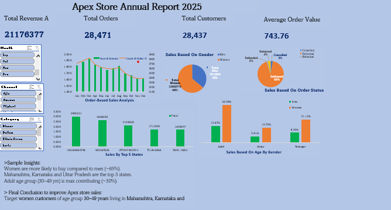

# Apex Store Sales Analysis Dashboard (Excel)

## Project Overview

This project analyzes Apex Store sales data using Microsoft Excel. The dashboard provides insights into sales performance, customer demographics, order status, and regional sales trends.

## Tools Used

- Microsoft Excel
- Pivot Tables
- Pivot Charts
- Slicers
- Data Cleaning
- Dashboard Design

## Dashboard Preview

## Key Insights

- Monthly sales and order trends
- Sales distribution by gender
- Sales analysis by age group
- Top performing states
- Order status analysis
- Channel-wise sales performance

## Dataset Information

The dataset contains:

- Order ID
- Customer ID
- Gender
- Age
- Order Status
- Sales Amount
- Product Category
- Sales Channel
- State Information

## Skills Demonstrated

- Data Cleaning
- Data Analysis
- Dashboard Creation
- Business Intelligence
- Data Visualization

## Project File

- Apex Store Data Analysis.xlsx
